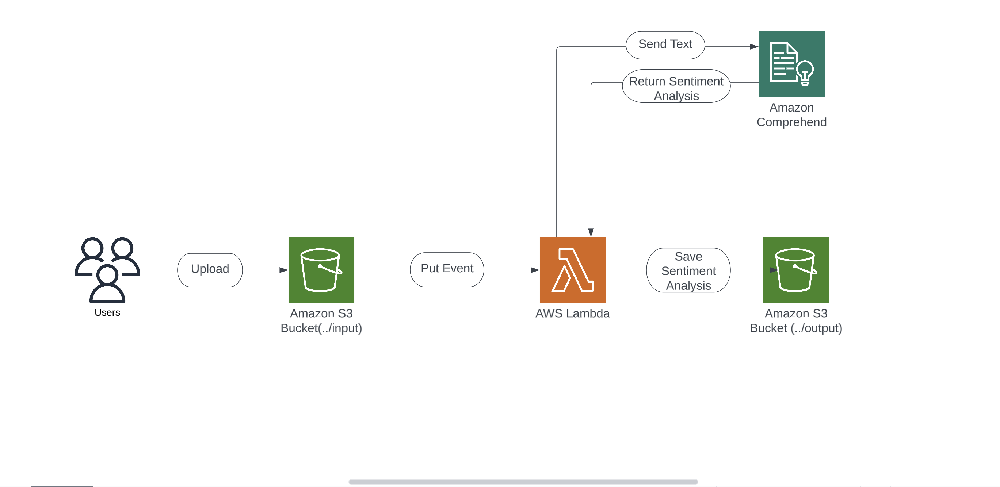

# Customer Sentiment Analysis with AWS Comprehend

- Users upload documents to S3 bucket to start text analysis by using Amazon Comprehend.
- Amazon Comprehend uses natural language processing(NLP) to analyze text documents, such as customer supoort tickets, product reviews, emails and social media fees.
- To start the analysis process for this solution, S3 bucket is configured to send an event notificaiton when a new document is uploaded. Then notification invokes Lambda function.
- Then the Lambda function calls the Comprehend API and provides the uploaded document to the service for text analysis.
- Comprehend process the text by using NLP to extract key phrases, entities and sentiment for further analysis. The service then returns to the Lambda function.
- The Lambda function saves the analysis data to the S3 bucket output folder.
